# My CSS Battle Solutions
## Battle1-1
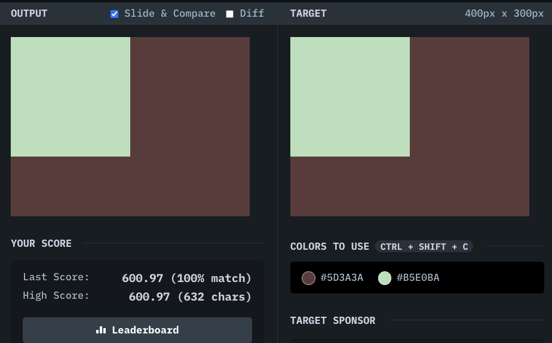
## Solution
```html
<div></div>
<style>

  body {
    background:#5D3A3A;
  }
  
  div {
    width: 50%;
    height: 200;
    background: #B5E0BA;
    position:absolute;
    top:0;
    left:0;
  }
</style>
```
## Battle1-3
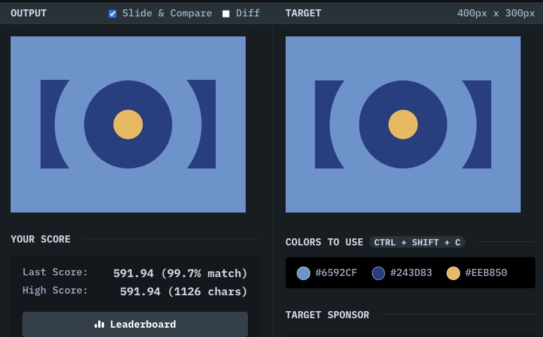
## Solution
```html
<div class = "centerRectangle">
  <div class = "bigCircle">
    <div class = "smallCircle"></div>
  </div>
  </div>

<style>

  body {
    background:#6592cf;
  }
  
  .centerRectangle {
    margin-top:74px;
    margin-left:43px;
    background:#243d83;
    width:298px;
    height:151px;
    display:flex;
    justify-content:center;
    align-items:center;
  }

  .bigCircle {
    height:150px;
    width:150px;
    border-radius:50%;
    background:#243d83;
    display:flex;
    justify-content:center;
    align-items:center;
    border: 50px solid #6592CF;
  }

  .smallCircle {
    width:50px;
    height:50px;
    border-radius:50%;
    background:#EEB850;
  }
</style>
```
## Battle1-4
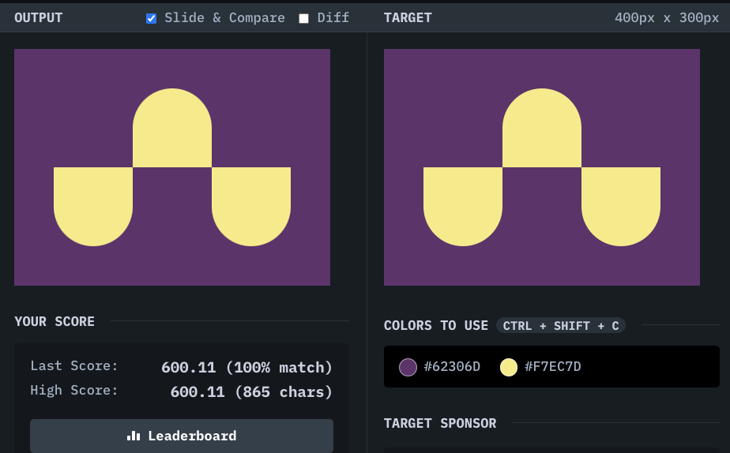
## Solution
```html
<div class = "eContainer">
<div class = "e1"></div>
<div class = "e2"></div>
<div class = "e3"></div>
</div>
<style>

  body{
    display:flex;
    background:mediumturquoise;
    align-items:center;
    background:#62306D;
  }

  .eContainer {
    display:flex;
    width:400px;
    height:100px;
    background:#62306D;
    justify-content:center;
    margin-bottom:100px;
  }
  
  .e1 {
    margin-top:100px;
    width: 100px;
    height: 100px;
    background: #f7ec7d;
    border-bottom-left-radius:50%;
    border-bottom-right-radius:50%;
  }
  .e2 {
    width: 100px;
    height: 100px;
    background: #f7ec7d;
    border-top-left-radius:50%;
    border-top-right-radius:50%;
  }
  .e3 {
    width: 100px;
    height: 100px;
    background: #f7ec7d;
    margin-top:100px;
    border-bottom-left-radius:50%;
    border-bottom-right-radius:50%;
  }
</style>
```
## Battle1-5
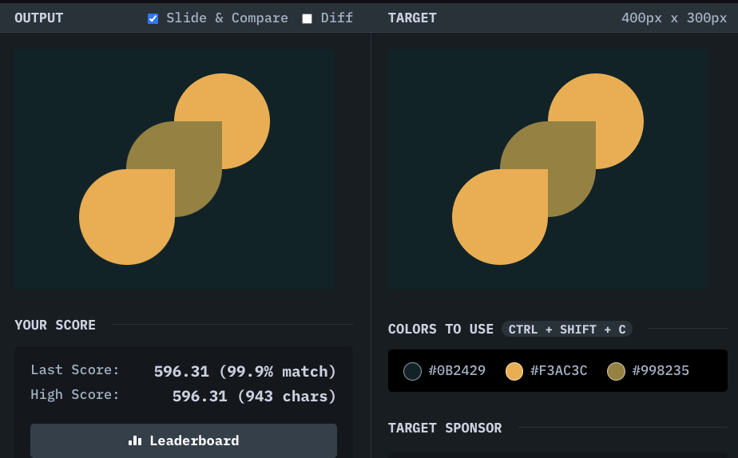
## Solution
```html
<div class  = "container">
<div class = "a1"></div>
<div class = "a2"></div>
<div class = "a3"></div>
  </div>

<style>

  body {
    margin:0;
  }
  
  .container{
    
    display:flex;
    justify-content:center;
    align-items:center;
    height:100%;
    display:flex;
    background:#0B2429;
  }
  
  .a1 {
    
    width: 120px;
    height: 120px;
    margin:5;
    margin-top:125px;
    margin-left:-114px;
    background: #F3AC3C;
    border-radius: 50%;
    border-top-right-radius:0px;
    z-index:2;
    position:absolute;
  }
  .a2 {
    width: 120px;
    height: 120px;
    margin:5;
    margin-left:5px;
    background: #998235;
    border-radius: 50%;
    border-top-right-radius:0px;
    z-index:1;
    
  }
  .a3 {
    width: 120px;
    height: 120px;
    margin:5;
    background: #F3AC3C;
    border-radius: 50%;
    z-index:0;
    margin-left:125px;
    margin-bottom:125px;
    position:absolute;
    
  }
  
</style>
```
## Battle1-6
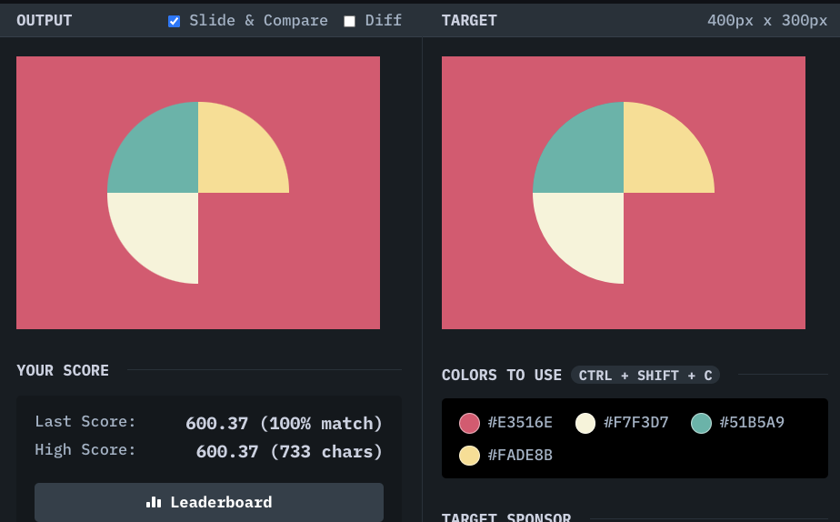
## Solution
```html
<div class = "firstRow">
  <div class = "main sq1"></div>
  <div class = "main sq2"></div>
</div>
<div class = "secondRow">
  <div class = "main sq3"></div>
</div>

<style>

  body {
    margin:0;
    background:#E3516E
  }

  
  .firstRow {
    background:#E3516E;
    width:100%;
    height:50%;
    display:flex;
    justify-content:center;
    align-items:center;
  }
  
  .main {
    width: 100px;
    height: 100px;
    margin-top:50px;
  }

  
  .sq1 {
    
    background: #51B5A9;
    border-top-left-radius:100%;
  }
    .sq2 {
    
    background: #FADE8B;
    border-top-right-radius:100%;
  }
    .sq3 {
    margin-top:0;
    margin-left:100px;
    background: #F7F3D7;
    border-bottom-left-radius:100%;
  }
</style>
```
## Battle1-7
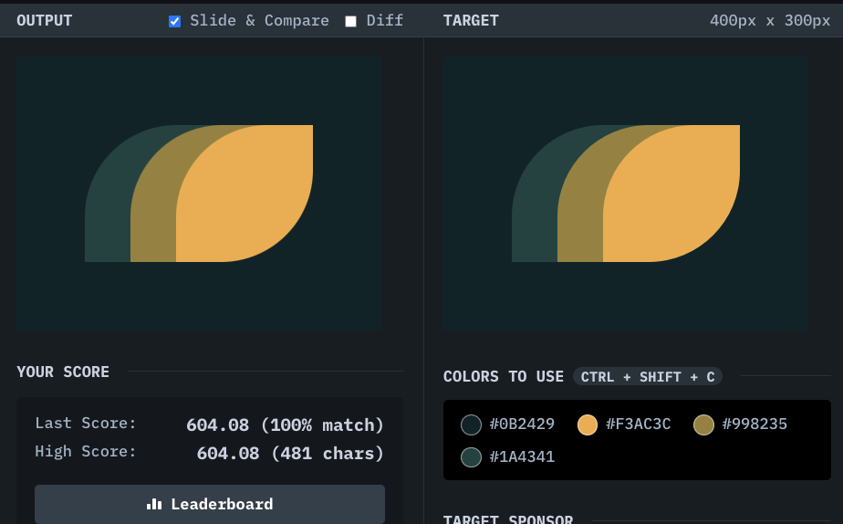
## Solution
```html
<div class = "main s1"></div>
<div class = "main s2"></div>
<div class = "main s3"></div>
<style>
  body{
    background:#0B2429;
    display:flex;
    justify-content:center;
    align-items:center;
  }
  .s3 {
    background: #F3AC3C;
    }
  .s2 {
    background:#998235;
  }
  .s1{
    background:#1A4341;
  }
  
  .main {
    width:150px;
    height:150px;
    border-radius:67%;
    border-top-right-radius:0;
    border-bottom-left-radius:0;
    margin:-50;
  }  
</style>
```
## Battle1-9
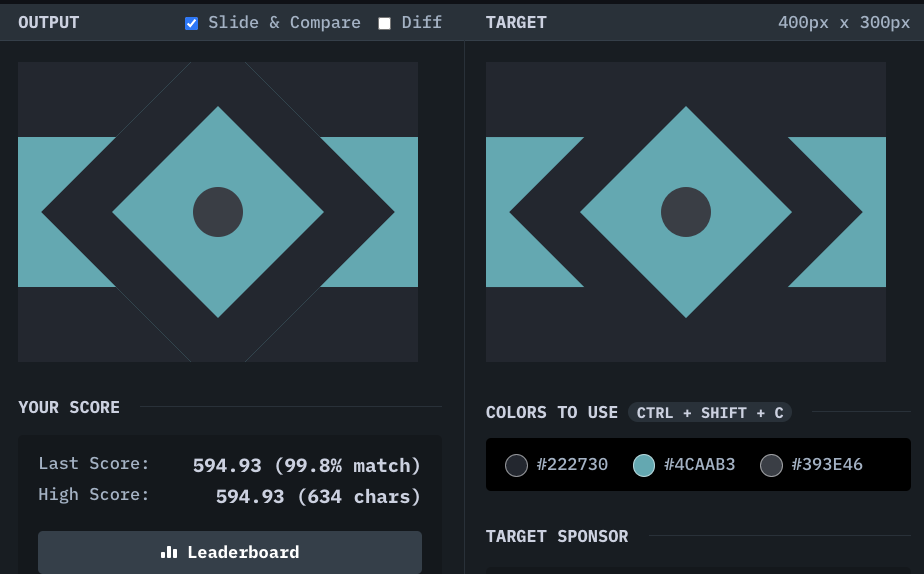
## Solution
```html
<div class = "square"></div>
<div class = "circle"></div>  
<div class = "line" ></div>

<style>
  
  body {
    display: flex;
    justify-content: center;
    align-items:center;
    background:#222730;
    margin:0;
  }
  
  .line {
    width: 100%;
    height:150px;
    background:#4caab3;
    position:absolute;
    z-index:-1;
    
  }

  
  
  .square {
    width: 150px;
    height: 150px;
    background: #4CAAB3;
    transform: rotate(45deg);
    border: 50px solid #222730
  }

.circle {
    width:50px;
    height:50px;
    background: #393e46;
    border-radius:50%;
    z-index:1;
    position:absolute;
}
</style>
```
## Battle1-11
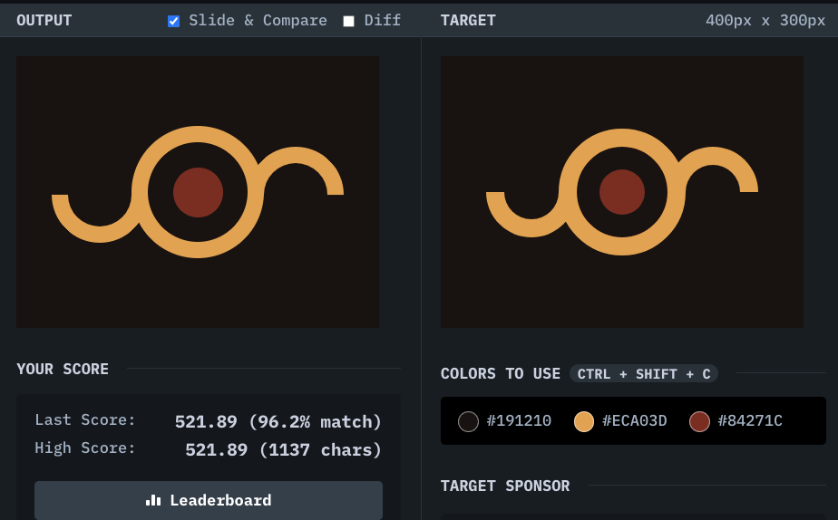
## Solution
```html
<div class = "circle"></div>
<div class = "Bcircle"></div>
<div class = "circle1"" ></div>
<div class = "circle2"></div>
<style>

  body {
    display: flex;
    justify-content:center;
    align-items:center;
    background:#191210;
  }


  .circle1 {
    position:absolute;
    width:70px;
    height:70px;
    border-radius:50%;
    border: 18px solid #eca03d;
    top:100px;
    right:255px;
    z-index:1;
    background:transparent;
    border-top-color:transparent;
    border-left-color:transparent;
    transform: rotate(45deg);
  }

  .circle2 {
    position:absolute;
    width:70px;
    height:70px;
    border-radius:50%;
    border: 18px solid #eca03d;
    top:100px;
    right:39px;
    z-index:1;
    background:transparent;
    border-top-color:transparent;
    border-left-color:transparent;
    transform: rotate(-135deg);
  }
  
  .Bcircle {
    width: 110px;
    height: 110px;
    border-radius:50%;
    background: #191210;
    position:absolute;
    z-index:-1;
    border: 18px solid #ECA03D;
  }

  
  .circle {
    width: 55px;
    height: 55px;
    border-radius:50%;
    background: #84271c;
  }
</style>
```
## Battle8-43
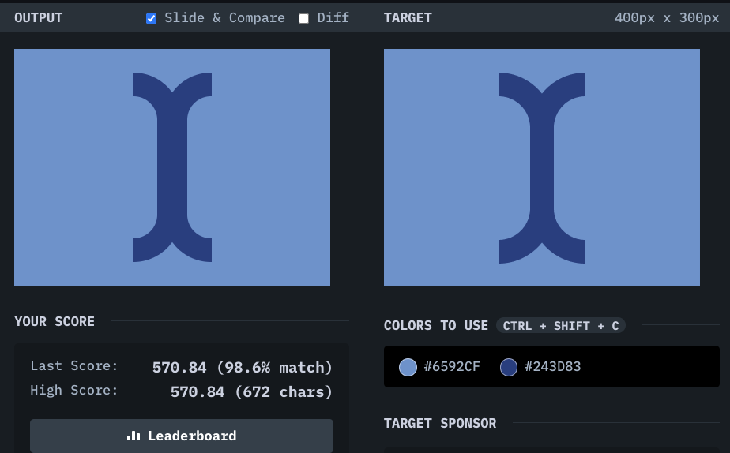
## Solution
```html
<div class = "a"></div>
<div class = "a"></div>
<div class = "square"></div>
<div class = "square2"></div>
<style>

  body{
    margin:0;
    display:flex;
    flex-direction:row;
    justify-content:center;
    align-items:center;
    background:#6592cf;    
  }

  .square {
    position:absolute;
    height:300px;
    width:300px;
    background:#6592cf;
    margin-left:100%;
  }
    .square2 {
    position:absolute;
    height:300px;
    width:300px;
    background:#6592cf;
    margin-left:-100%;
  }
  
  
  .a {
    margin:-11px;
    width: 80;
    height: 180px;
    border-radius:60px;
    background:#6592cf;
    border:30px solid #243d83;
    
  }
</style>
```
## Battle10-48
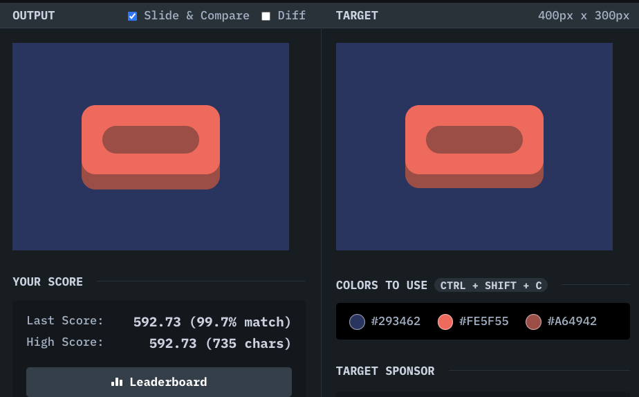
## Solution
```html
<div class = "container">
<div class = "inside"></div>
  </div>
<div class = "last"></div>
<style>

 body{
   display:flex;
   justify-content:center;
   align-items:center;
   background:#293462
 }

  .inside {
    background:#a64942;
    width:140px;
    height:40px;
    border-radius:20px;
  }

  
  .container {
    width: 200px;
    height: 100px;
    margin-top:-20px;
    display:flex;
    background: #fe5f55;
    align-items:center;
    justify-content:center;
    border-radius:20px;
  }
   .last{
    width: 200px;
     position:absolute;
    height: 100px;
     top:112px;
    display:flex;
    background:#a64942;
    align-items:center;
    justify-content:center;
    border-radius:20px;
     z-index:-1;
  }
</style>
```
## Battle10-51
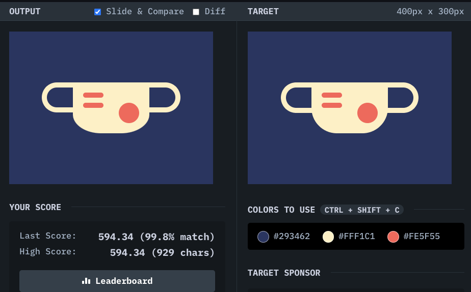
## Solution
```html
<div class = "back">

<div class = "line ln1"></div>
<div class = "line ln2"></div>
<div class = "circle"></div>
</div>
<div class = "back2"></div>
<style>
  body {
    display:flex;
    justify-content:center;
    align-items:center;
    background:#293462;
  }

  .circle {
    width:40px;
    height:40px;
    border-radius:50%;
    background:#fe5f55;
    margin-left:90;
    margin-top:-10;
  }


  
  .line 
  {
    background:#fe5f55;
    width:40px;
    height:10px;
    margin-left:20px;
    margin-top:10px;
    border-radius:500px;
  }

  .ln1 {
    margin-top:20px;
  }
  
  .back {
    
    width: 150px;
    height: 100px;
    background: #fff1c1;
    border-bottom-left-radius:37%;
    border-bottom-right-radius:37%;
    z-index:1;
  }
  .back2 {
    position:absolute;
    background:#293462;
    width: 63%;
    height:13%;
    top:100;
    border-radius:500px;
    border:10px solid #fff1c1;
  }
</style>
```
## Battle11-57
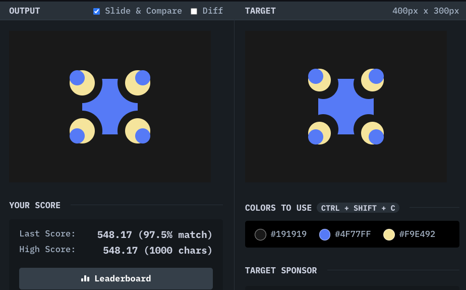
## Solution
```html
<div class= "square"></div>

<div class = "line1">
<div class = "bigCircle">
<div class = "smallCircle"></div>
</div>
<div class = "bigCircle b2">
<div class = "smallCircle"></div>
</div>
  </div>
<div class = "line2">
<div class = "bigCircle b3">
<div class = "smallCircle"></div>
</div>
<div class = "bigCircle b4">
<div class = "smallCircle"></div>
</div>
  </div>
<style>

  body {
    display:flex;
    justify-content:center;
    align-items:center;
    background:#191919;
  }

  .square
  {
    width:110px;
    height:110px;
    z-index:-1;
    background:#4f77ff;
    position:absolute;
  }
  
  .b2 {
    transform:rotate(-90deg)
  }

  .b3 
  {
    transform:rotate(90deg);
  }

  .b4 {
    transform:rotate(180deg);
  }
  
  .bigCircle {
    width: 45px;
    height: 45px;
    border-radius:60%;
    background: #f9e492;
    border:20px solid #191919;
    margin:18;
  }
  .smallCircle
  {
    width: 30px;
    height: 30px;
    border-radius:50%;
    background: #4f77ff;
  }
</style>
```
## Battle13-69
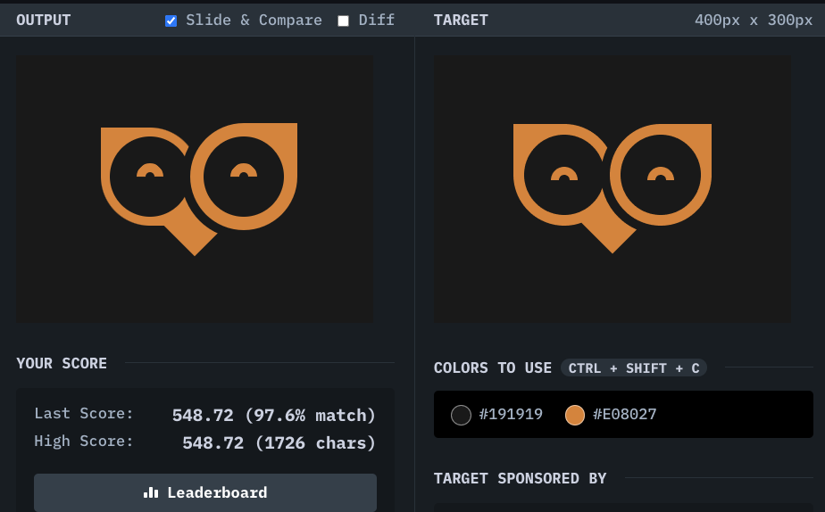
## Solution
```html
<div class = "container">
<div class = "inCircle"></div>
  <div class = "inBigCircle"></div>
  </div>
<div class = "container2">
<div class = "inCircle2"></div>
  <div class = "inBigCircle"></div>
  </div>
<div class = "square"></div>
<style>


  .square{
    position:absolute;
    background:#e08027;
    height:50px;
    width:50px;
    transform:rotate(45deg);
    top:165;
    z-index:-3;
  }

  .inBigCircle {
    width:90px;
    height:90px;
    position:absolute;
    background:#191919;
    border-radius:50%;
    z-index:-1;
  }
  
  body {
    display:flex;
    justify-content:center;
    align-items:center;
    margin-top:-20px;
    background:#191919;
  }
  .container{
    width: 110px;
    height: 110px;
    background: #e08027;
    display:flex;
    justify-content:center;
    align-items:center;
    border-top-right-radius:50%;
    border-bottom-left-radius:50%;
    z-index:-2;
  }

  .container2{
    width: 120px;
    height: 120px;
    background: #e08027;
    display:flex;
    justify-content:center;
    align-items:center;
    border-top-right-radius:50%;
    border-bottom-left-radius:50%;
    border-bottom-right-radius:50%;
    border:10px solid #191919;
    transform:rotate(90deg);
    margin:-20;
  }


  .inCircle{
    
    height:10px;
    width:10px;
    border-radius:50%;
    background:#191919;
    border:10px solid #e08027;
    border-top: 10px solid #191919;
    border-left: 10px solid #191919; 
    transform:rotate(225deg);
  }
  .inCircle2{
    
    height:10px;
    width:10px;
    border-radius:50%;
    background:#191919;
    border:10px solid #e08027;
    border-top: 10px solid #191919;
    border-left: 10px solid #191919; 
    transform:rotate(135deg);
  }
</style>
```
## Battle19-113
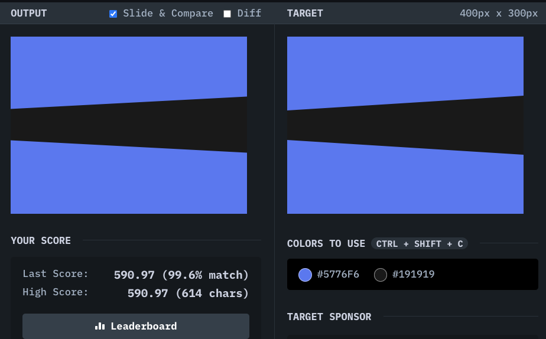
## Solution
```html

<div class = "a"></div>
<div class = "b"></div>
<div class = "c"></div>
<style>

  body {
    display:flex;
    background:#5776f6;
    justify-content:center;
    align-items:center;
    margin:0;
  }
  
  .a {
    width: 100%;
    height: 40px;
    background: #191919;
  }
   .b {
     position:absolute;
     width: 1050;
    height: 60px;
     top:126px;
    background: linear-gradient(transparent 50% , #191919 50%);
    transform:rotate(3deg);
    
   }
  .c {
     position:absolute;
     width: 1450;
    height: 50px;
     top:112px;
    background: #191919;
    transform:rotate(-3deg);
   }

</style>
```
## Battle19-116
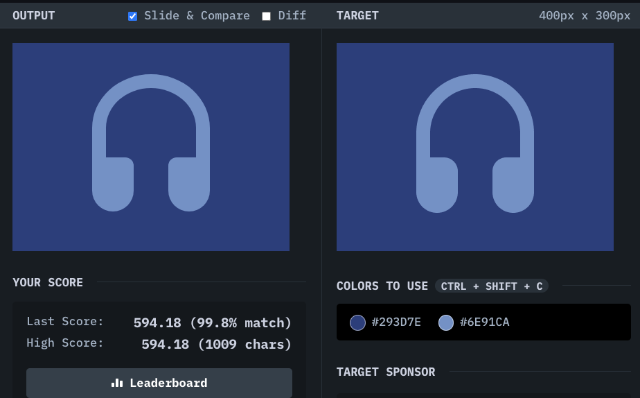
## Solution
```html
<div class = "square ab"></div>
<div class = "square a"></div>
<div class = "square b"></div>
<style>

  body {
    display:flex;
    justify-content:center;
    align-items:center;
    background:#293d7e
    
  }
  
  .square {
    width: 130px;
    height: 115px;
    border-top-left-radius:50%;
    border-top-right-radius:50%;
    border:20px solid #6e91ca;
    border-bottom-color:transparent;
  }

  .ab{
    margin-top:-55px;
  }

  .b {
    position:absolute;
    width:20px;
    height:38px;
    margin-top:155px;
    left:115px;
    top:10;
    border-top-left-radius:0;
    border-top-right-radius:20px;
    border-bottom-right-radius:50px;
    border-bottom-left-radius:50px;
    background:#6e91ca;
  }

  .a {
    position:absolute;
    width:20px;
    height:38px;
    margin-top:155px;
    left:225px;
    top:10;
    border-top-left-radius:20px;
    border-top-right-radius:20px;
    border-bottom-right-radius:50px;
    border-bottom-left-radius:50px;
    background:#6e91ca;
  }
  
</style>
```